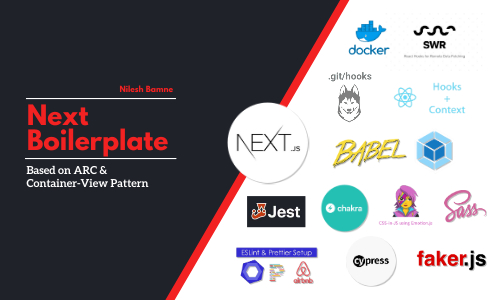

<div align="center" >

</div>

<br/>
<div align="center">Performance oriented Next.js application boilerplate with SWR, SASS, Chakra UI, Git Hooks, SEO, Babel, Jest, Emotion JS, ESLint, Prettier, Airbnb, CyPress, Faker JS, Hooks, Context API and Docker.</div>
<br/>

## About

Next.js is a minimalistic React framework that runs on the browser and the server. It offers developers an easy way to get started, and as it uses React.js for templating, it's also a straightforward way for developers with React experience to get productive quickly.

The advantage of this approach is to be able to create rich user experiences in a uniform way, without compromising SEO (Search Engine Optimisation) factors that are key to good ranking on Google and other search engines.

This boilerplate makes it easier to get up and running with a well-structured Next.js and TypeScript application.

<br/>

## Features

next-boilerplate project provides a lot of features out of the box. Here's an overview of the included components and tools.

- <a href="https://nextjs.org/">**Next.js**</a> - Minimalistic framework for server-rendered React applications.
- <a href="https://chakra-ui.com/">**Chakra UI**</a> - Chakra UI for faster UI development.
- <a href="https://graphql.org/">**Graphql**</a> - A query language for your API.
  <br/>
- <a href="https://github.com/marak/Faker.js/">**Faker.js**</a> - Generate Fake data using Faker.js.
  <br/>
- <a href="">**Graphql - Faker.js**</a> - Generate Data using Graphql using Faker.js.
  <br/>
- <a href="">**Docker**</a> - A tool designed to make it easier to create, deploy, and run applications by using containers.
- <a href="">**Sass/Scss**</a> - CSS preprocessor, which adds special features such as variables, nested rules and mixins (sometimes referred to as syntactic sugar) into regular CSS.
- <a href="">**Babel**</a> - The compiler for next generation JavaScript.
- <a href="">**ESLint**</a> - The pluggable linting utility.
- <a href="">**Bundler Analyzer**</a> - Visualize the size of webpack output files with an interactive zoomable treemap.
- <a href="">**Jest**</a> - Javascript testing framework , created by developers who created React.
- <a href="">**React Testing Library**</a> - Simple and complete React DOM testing utilities that encourage good testing practices.
- <a href="">**next-runtime-dotenv**</a> - Expose environment variables to the runtime config of Next.js
- <a href="">**Debugging**</a> - To debug Run dev command in terminal and Start VS Code in Debug mode. Install Debugger For Chrome Plugin first.
- <a href="https://medium.com/@robertsavian/generate-template-files-with-ease-19b320615359">**Generator**</a> - Generate Pages and Components with Component-View pattern.
  <br/>
- <a href="https://blog.maddevs.io/best-architecture-for-the-react-project-149b377b379d">**ARC Desing Pattern**</a>
- <a href="https://medium.com/@dan_abramov/smart-and-dumb-components-7ca2f9a7c7d0">**Container Desing Pattern**</a>

- <a href="https://youtu.be/Lj_jAFwofLs">**Git Workflow**</a>

## Install VSCode Extensions

```sh
cat extensions.txt | xargs -L 1 code --install-extension
```

## Install

```sh
yarn install
```

## Setup

```sh
Set it to the command/path of your editor in ~/.zshenv or ~/.bashrc:

export EDITOR=<editorname>
```

## Usage

```sh
yarn build

yarn start
```

## Run tests

```sh
yarn run test
```

## Author

**Nilesh Bamne <nilesh@gethelpnow.com>**

- Github: [@nilesh-bamne](https://github.com/nilesh-bamne)
- LinkedIn: [@nilesh-bamne-60007419](https://linkedin.com/in/nilesh-bamne-60007419)

## License

Licensed under the MIT License
